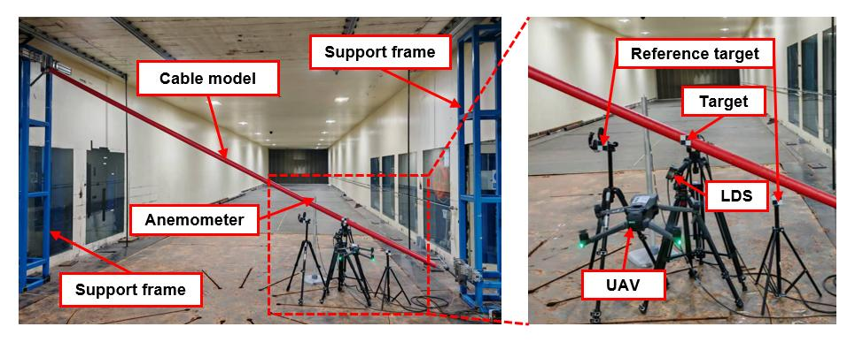
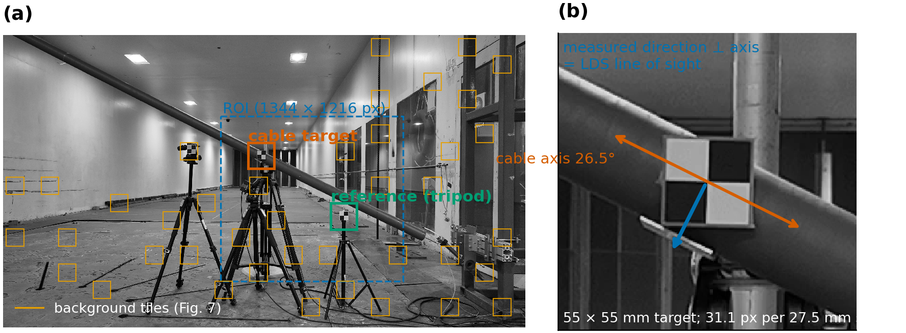
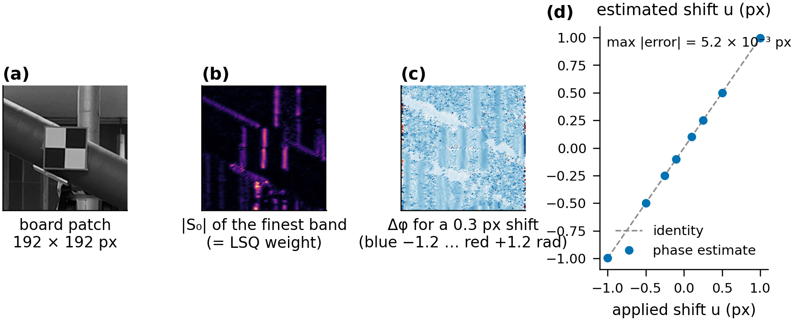
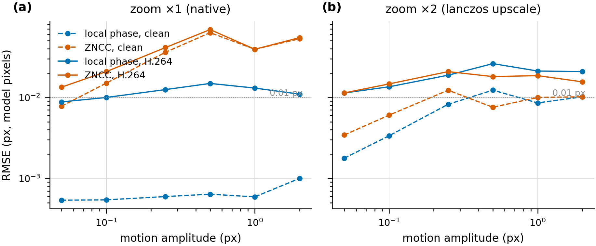
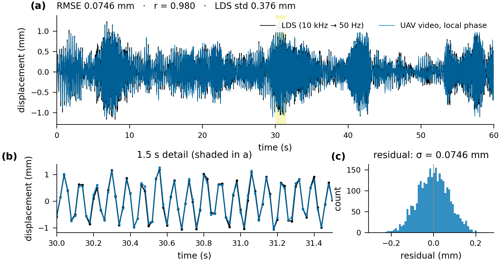
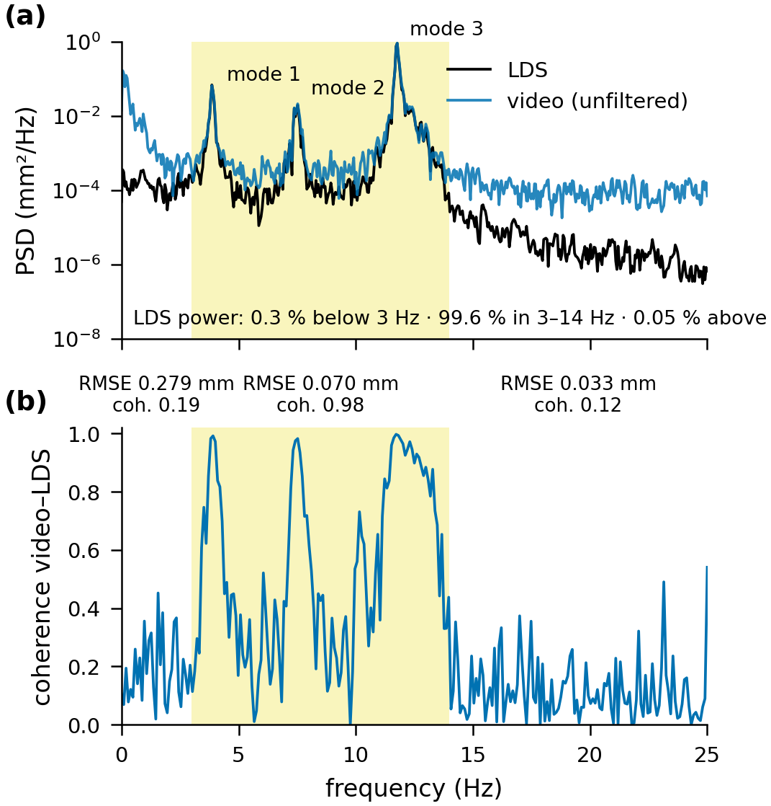
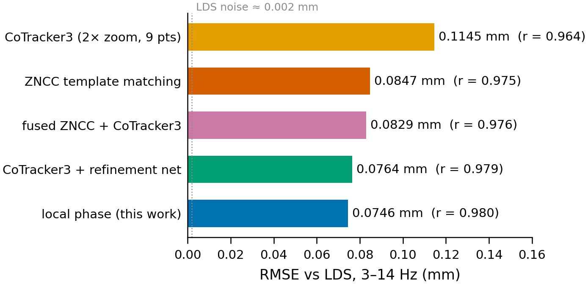
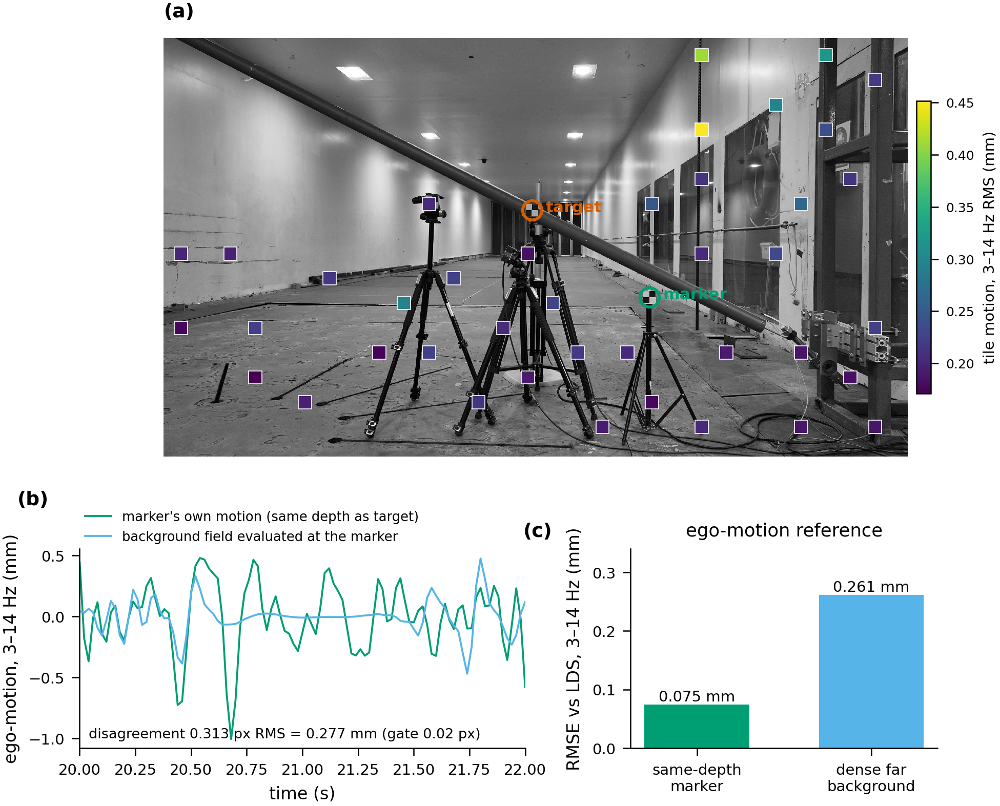
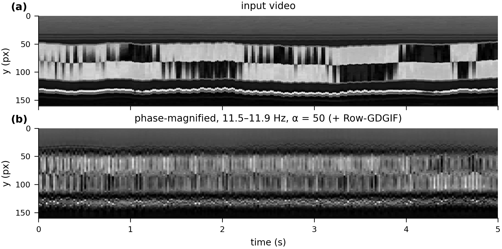

# Sub-pixel displacement of a vibrating cable from hovering-UAV video

Measuring the vibration of a stay-cable model from a DJI Mavic 3 Pro hovering 2 m away — a ±1.5 px, 0.9 mm-per-pixel signal buried under the drone's own motion — with a **local-phase tracker** on a complex steerable pyramid (after Chen et al. 2015), validated against a 10 kHz laser displacement sensor. **Result: 0.0746 mm RMSE, r = 0.980, over the full 60 s at 50 Hz — better than a scene-adapted refinement CNN (0.076), ZNCC template matching (0.085) and the CoTracker3 foundation tracker (0.115) on the same pipeline. The tracker's own noise is 0.006 mm; what remains is the scene (depth parallax of the drone's jitter, rolling shutter), and a dense 40-tile background ego-motion field makes it *worse* (0.261 mm) because the background is not at the target's depth.**

This repo holds the code (numpy/scipy, optional torch backend), the results (figures, tables, per-band scores, ablations), a one-command inference script and the released tracks/checkpoints. Task: Project 1 of the Harbin Institute of Technology structural-health-monitoring benchmark (wind-tunnel vortex-induced vibration, wind 3.62 m/s, cable inclination 26.95°).

---

## 1. The problem

<p align="center"></p>

*Fig. 0 — Wind-tunnel setup (figure from the competition brief, Harbin Institute of Technology, Joint Laboratory of Wind Tunnel and Wave Flume): the inclined stay-cable model between its support frames, the anemometer, and — in the inset — the target on the cable, the reference target on a tripod, the laser displacement sensor (LDS) and the hovering UAV.*

Two 55 × 55 mm checkerboards: one on the cable at L/6 from its lower end, one on a tripod ≈ 2 m from the camera like the cable. Only the in-plane displacement perpendicular to the cable axis matters — it is what the laser (LDS) measures. The board is 31 px wide; the vibration is ±1.5 px, so everything hinges on sub-pixel accuracy and on removing the drone's motion.

<p align="center"></p>

*Fig. 1 — Frame 0 (3840 × 2160 px, 50 fps). (a) Region of interest, the two targets, and the 40 background tiles used in Section 6. (b) The cable axis (26.5° in the image) and the measured direction perpendicular to it, which is the LDS line of sight.*

**Data.** `Video.MP4` (60.66 s, 3033 frames, H.264) and `LDS data.xlsx` (10 kHz, no time column, sub-second unknown clock offset to the video, not zero at frame 1) — provided by the competition, not redistributed here. Scoring: RMSE against the LDS after mean removal and cross-correlation alignment (`src/uav_disp/evaluate.py`).

---

## 2. Local phase as a sub-pixel ruler

Each frame's board patch (192² px) is decomposed by a complex steerable pyramid (4 half-octave scales × 2 orientations, one-sided, tight frame). The wrap-safe phase difference against frame 0, Δφ = arg(S_t · conj S_0), obeys the phase-constancy constraint φ_x u + φ_y v + Δφ = 0 (Chen et al., Eq. 3), which is solved for the shift (u, v) by amplitude-weighted least squares over all bands — a 2 × 2 normal system per frame — followed by one Gauss–Newton pass that Fourier-shifts the reference spectrum. The linearisation point is a ZNCC template-matching estimate (integer part as a piecewise-constant re-cut of the patch, fractional part as a prior), so the phase only carries ZNCC's ~0.1 px residual and never wraps. Each frame also yields a predicted σ, an effective sample count and a condition number.

<p align="center"></p>

*Fig. 2 — (a) Board patch. (b) Amplitude of the finest horizontal band (the least-squares weight). (c) Δφ after a synthetic 0.3 px Fourier shift: uniform over the checker edges. (d) Recovered vs applied shift, ±1 px: max error 5 × 10⁻³ px from one band alone.*

<p align="center"></p>

*Fig. 3 — Synthetic sequences built from the real frame-0 board (300 frames, sinusoidal motion, exact ground truth). Noise-free the phase tracker is at 0.001 px; under H.264 it is 0.009–0.015 px versus 0.04–0.07 px for ZNCC. 2× Lanczos upscaling helps ZNCC but hurts phase, so phase runs at native resolution. The codec, not the estimator, sets the floor.*

---

## 3. Result against the laser

Ego-motion is cancelled by subtracting the stationary reference-board track, the relative motion is projected on the cable-axis normal (axis from a PCA of the red-cable mask, 26.5° ≈ 26.95° physical), scaled by 27.5 mm per checker square, and band-passed to 3–14 Hz.

<p align="center"></p>

*Fig. 4 — (a) LDS (black) and video (blue), mean-removed, aligned by cross-correlation (0.20 s offset). (b) 1.5 s detail. (c) Residual histogram. RMSE 0.0746 mm, r = 0.980; LDS std 0.376 mm.*

<p align="center"></p>

*Fig. 5 — Why 3–14 Hz. (a) Spectra of the unfiltered video result and the LDS: 99.6 % of the cable's power is in 3–14 Hz (modes at 3.9, 7.5, 11.7 Hz). (b) Video–LDS coherence is 0.98 there and 0.19 below 3 Hz, where the video carries extra power that is not vibration but residual UAV parallax; band RMSE 0.279 / 0.070 / 0.033 mm for 0–3 / 3–14 / 14–25 Hz.*

---

## 4. Five trackers, one pipeline

Everything downstream of the tracker (detection, ego-motion cancellation, projection, band-pass, alignment) is shared, so the table isolates the tracker.

<p align="center"></p>

| tracker | RMSE 3–14 Hz (mm) | r | note |
|---|---|---|---|
| CoTracker3 online, 2× zoom, 9 points + support grid | 0.1145 | 0.964 | foundation model, torch.hub |
| ZNCC template matching, quadratic sub-pixel peak | 0.0847 | 0.975 | classical baseline |
| fused 0.8 ZNCC + 0.2 CoTracker3 | 0.0829 | 0.976 | |
| CoTracker3 + scene-adaptive refinement CNN (300 k params, self-supervised on Fourier-shifted patches) | 0.0764 | 0.979 | previous best |
| **local phase (this work)** | **0.0746** | **0.980** | 29 s on one GPU, 5 min on 8 CPU cores |

Full-band (0–25 Hz) the phase result is 0.291 mm — all of it below 3 Hz (Fig. 5). Tables: [`tables/results.md`](tables/results.md).

---

## 5. What limits the accuracy is not the tracker

Thirteen estimator variants run on the full video (number of scales and orientations, weighting, Chen's per-orientation estimator, Chen-style decimation, no Gauss–Newton pass, per-frame re-cut, …) all land within ±0.001 mm of the baseline, while the tracker's own predicted noise σ varies six-fold between them (0.007–0.05 mm). The 0.075 mm residual is therefore a systematic scene term, ten times the tracker noise. The one decisive ingredient is the ZNCC linearisation point: without it 44 % of frames exceed the phase-wrap limit and the error doubles (0.162 mm). Full table: [`results/ablations.md`](results/ablations.md) §E.

---

## 6. Tried and did not help: a dense background ego-motion field

The natural next step — replace the single reference board by a dense field from 40 static, textured background tiles tracked with the same phase estimator (Huber-robust affine fit, evaluated at the target) — fails a simple go/no-go test and is reported as a negative result.

<p align="center"></p>

*Fig. 7 — (a) The 40 tiles over the full 4K frame, coloured by their 3–14 Hz motion. (b) The affine field evaluated at the tripod board versus the board's own motion: they disagree by 0.31 px RMS in band (gate: 0.02 px). (c) Used as the reference, the field raises the error from 0.075 to 0.261 mm.*

The tripod board is at the cable's depth; the background is several times farther, so the drone's translational jitter maps to different pixel shifts on the two (Δx = f·Δt/Z — 0.2 px at 2 m is only ≈ 0.1 mm of drone motion). A same-depth reference cancels this parallax exactly; a distant background cannot, however densely it is sampled. The remaining 0.07 mm in-band residual is what a *single* camera cannot separate without a second same-depth reference.

A rolling-shutter line delay was also estimated from the same pass (from the tiles and from six points along the cable); the two estimates disagree (8.7 vs −7.6 µs/row, r² 0.16 / 0.07), so no rolling-shutter correction is applied and none is claimed.

<p align="center"></p>

*Fig. 8 — Visual check only: phase-based motion magnification (α = 50, 11.5–11.9 Hz, Row-GDGIF of Yang & Jiang 2024) turns the invisible 0.02 px third mode into a visible rigid up-and-down motion of the whole board.*

---

## Try it — measure a video

[`inference/measure_displacement.py`](inference/measure_displacement.py): video in, 50 Hz CSV out (`time_s,displacement_mm`). Two passes over the video (ZNCC coarse track, then the phase tracker), numpy/scipy only; `--device cuda` uses the batched torch-FFT backend (29 s for 3033 frames).

```bash
pip install -r requirements.txt            # numpy, scipy, matplotlib, imageio-ffmpeg (+ torch for --device cuda)
python inference/measure_displacement.py Video.MP4 --out displacement.csv --device cuda
# a new scene: crop containing both boards, approximate board centres (crop px), checker size
python inference/measure_displacement.py my.mp4 --roi 1600,600,1344,1216 --cable 300,290 --ref 907,738 \
        --square-px 30 --square-mm 27.5 --axis-deg 26.5 --band 3-14 --out out.csv
```

Released files (see [Releases](../../releases)): the competition submission CSV, the phase tracks with per-frame σ / N_eff / cond, the dense ego-motion field (40 tiles × 3033 frames), the refinement-net checkpoint of the CoTracker3 branch, and the magnified clips.

## Reproduce (competition check)

Deterministic: no random seeds, no training in the submitted path; CPU and CUDA backends agree to < 10⁻³ px. The whole sequence below has been run on a fresh virtual environment built only from `requirements-core.txt` (PBS stage `repro`).

**Environment**
```bash
git clone https://github.com/ducanhle156/uav-vision-displacement.git && cd uav-vision-displacement
python3 -m venv .venv && source .venv/bin/activate      # python 3.9–3.11
pip install -r requirements-core.txt                     # numpy, scipy, matplotlib, imageio-ffmpeg (static ffmpeg), pytest
pip install -r requirements.txt                          # optional: + torch (--device cuda, 10x faster) and the CoTracker3 baseline
```
**Data** (provided by the competition, not in the repo): `data/Video.MP4` (3840 × 2160, 50 fps, 3033 frames) and `data/LDS data.xlsx` (10 kHz, column A). `data/lds.npy` is created from the xlsx on first use (plain XML parse, no extra package).

**Sanity check, no data needed (~1 min)**
```bash
python -m pytest tests -q -m "not slow"                  # 41 tests: pyramid, phase estimator, GDGIF, magnification, ego-motion
```
**The submission (≈ 8 min CPU, ≈ 1 min with `--device cuda`)**
```bash
python scripts/run_zncc.py                               # -> results/tracks_zncc.npz   ZNCC coarse tracks (~2 min)
python scripts/run_phase.py [--device cuda]              # -> results/tracks_phase.npz  local-phase tracks (5 min CPU / 29 s GPU)
python scripts/run_pipeline.py phase --band 3-14         # -> results/submission_phase_3-14.csv + eval_phase_3-14.{png,npz}
python scripts/make_submission.py phase_3-14             # -> submission/  validated CSV + code + README + SHA-256 manifest
```
Expected output of the third step:
```
[phase] cable axis: 26.54 deg | lag: 10 samples (0.20 s) | sign: +1
[phase] band 3-14 Hz | RMSE: 0.0746 mm | corr: 0.9802 | LDS std: 0.3765 mm | n: 3000
```
Without the LDS, `python inference/measure_displacement.py data/Video.MP4 --band 3-14 --out displacement.csv` gives the same tracks on the video time base (the LDS time base is shifted by the 0.20 s clock offset).

**Every other number**

| figure / table | command | runtime |
|---|---|---|
| full band, per-band table (Fig. 5) | `python scripts/run_pipeline.py phase` | s |
| tracker comparison (Fig. 6) | `run_cotracker.py`; `run_pipeline.py cotracker\|zncc\|fused`; `run_refined.py`; `run_pipeline.py refined` | 10 min, torch |
| synthetic benchmark (Fig. 3) | `python scripts/run_synth_benchmark.py E4` and `… E4 --compress` | 20 min |
| ablations (`results/ablations.md` §E) | `PHASE_DEVICE=cuda python scripts/run_phase_ablations.py` | 14 × 15 s GPU |
| dense ego-motion field, negative result (Fig. 7) | `run_egomotion.py --device cuda`; `run_phase.py --ego dense --device cuda`; `run_pipeline.py phase_dense --band 3-14` | 11 min (3 min after `STAGE=cache4k`) |
| magnification (Fig. 8) | `python scripts/run_magnify.py --band 1 --frames 0:500` | 15 min, 16 cores |
| all figures | `python scripts/make_manuscript_figures.py` | 1 min |

`run_synth_benchmark.py` and `run_egomotion.py` read the cable-axis angle from `results/eval_zncc.npz` (written by `run_pipeline.py zncc`; a copy is committed). On a PBS cluster every row is a stage of `job.pbs`: `qsub -v STAGE=<cache|unit|phase_gpu|synth|ablate_gpu|ego_gpu|magnify|figs|submit|repro> job.pbs`. Design spec with measured gates: [`reference_paper/IMPLEMENTATION_PLAN.md`](reference_paper/IMPLEMENTATION_PLAN.md); project report: [`report.md`](report.md).

Not bit-for-bit reproducible, and not part of the submitted signal: `models/refine_net.pt` (CoTracker3 + refinement CNN, trained with random augmentation, 0.076 ± 0.001 mm on retraining) and the CoTracker3 numbers (torch.hub checkpoint, MPS/CUDA differ at 10⁻³ px).

## References and external resources

- Chen, J.G., Wadhwa, N., Cha, Y.-J., Durand, F., Freeman, W.T., Buyukozturk, O. Modal identification of simple structures with high-speed video using motion magnification. *J. Sound Vib.* 345 (2015) 58–71 — local-phase displacement (Eqs. 1–5); our estimator is the joint Eq. 3 solve on a steerable pyramid.
- Yang, Y., Jiang, S. Phase-based video motion magnification with an optimized 1D row guided dynamic gradient image filter. *Mech. Syst. Signal Process.* 215 (2024) — PVMM and Row-GDGIF, used for visual QC only.
- Simoncelli & Freeman (1995), Wadhwa et al. (2013) — complex steerable pyramid, re-implemented from scratch in `src/uav_disp/steerable.py`.
- Karaev et al. (2024) [CoTracker3](https://github.com/facebookresearch/co-tracker), checkpoint `scaled_online.pth` via torch.hub — baseline tracker.
- FFmpeg (via `imageio-ffmpeg`), NumPy, SciPy, Matplotlib, PyTorch.
- No private data or pretrained model enters the submitted displacement; only the provided video and LDS files were used.
